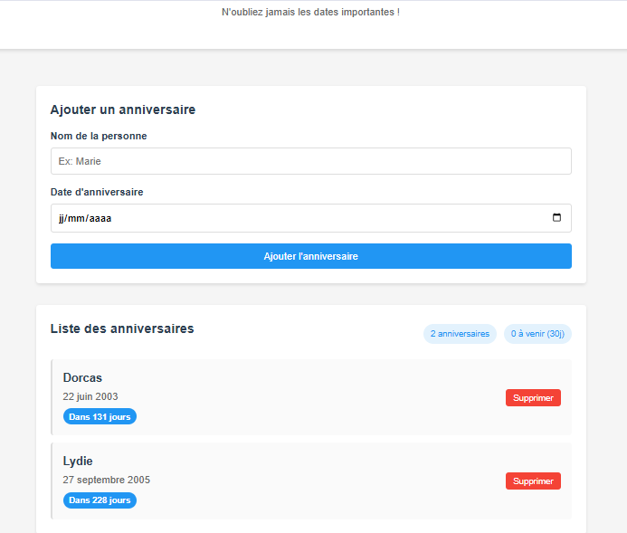

# Birthday_Reminder

## Description
Application web permettant d’enregistrer des anniversaires et d’afficher le nombre de jours restants avant chaque date.  
Ce projet est le **seizième** du défi personnel **100 projets en 2026**.

---

## Objectifs du projet
- Manipuler les dates en JavaScript
- Calculer des différences de jours
- Mettre en place un CRUD simple
- Utiliser le stockage local
- Concevoir une interface claire et pratique

---

## Plateforme
- Web (navigateur)

---

## Technologies utilisées
- HTML
- CSS
- JavaScript (Vanilla)
- LocalStorage

---

## Fonctionnalités
- Ajout d’un anniversaire (nom + date)
- Liste des anniversaires enregistrés
- Calcul automatique des jours restants
- Mise en évidence des anniversaires proches
- Suppression d’un anniversaire
- Sauvegarde locale des données

---

## Design & UX
- Interface simple et chaleureuse
- Formulaire clair pour l’ajout
- Liste lisible avec indicateur de jours restants
- Codes visuels pour les dates proches
- Responsive (mobile et desktop)

---

## Captures d’écran

---

## Ce que j’ai appris
- Manipulation des dates (`Date`)
- Calculs de différences de temps
- Gestion du stockage local
- Structuration d’un CRUD simple
- Amélioration de l’expérience utilisateur

---

## Améliorations possibles
- Notifications locales simulées
- Tri automatique par date
- Édition d’un anniversaire
- Import / export des données
- Mode sombre

---

## Statut du projet
 **Projet terminé**
